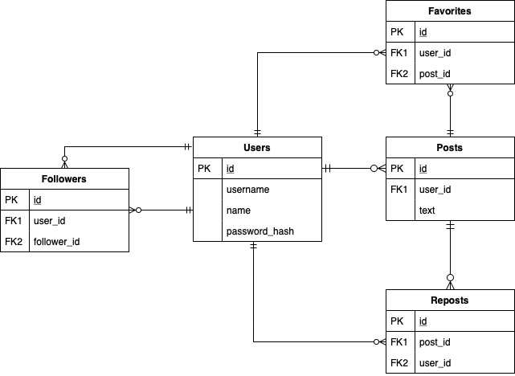

# ExMicroBlog

This is a Microblog toy project, where users can create accounts, post, favorite, repost and follow people. [It can be tested out on Heroku](https://exmicroblog.herokuapp.com) (it may take 30 seconds to spin up the free dynamo and load the site).

It's not very polished and certainly has some bugs. It also isn't fully covered in tests. The intention of the project was the play with Elixir and Phoenix LiveViews.

## Running the project

To start your Phoenix server:

  * Install dependencies with `mix deps.get`
  * Create and migrate your database with `mix ecto.setup`
  * Install Node.js dependencies with `cd assets && npm install`
  * Start Phoenix endpoint with `mix phx.server`

Now you can visit [`localhost:4000`](http://localhost:4000) from your browser.

## Entity Relationship Diagram

This is a toy project built totally on top of Postgres. In a real Microblog app the data should have been cached in a NoSQL database or something in the likes for performance reasons.

